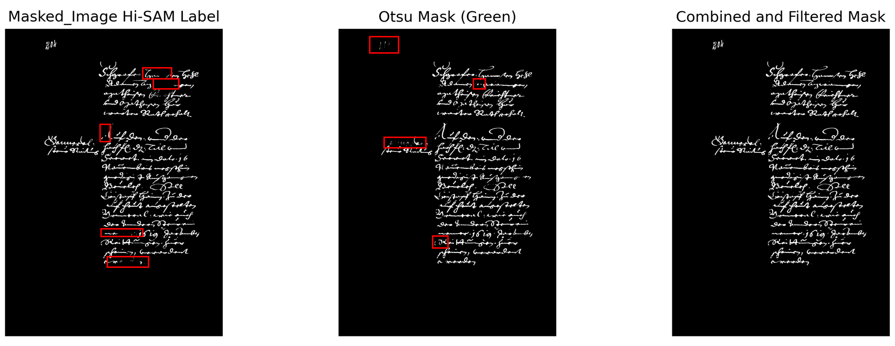

<h1 align="center">Hi-SAM model for Text Line Segmentation</h1> 

<p>The original work is from:</p>


> [Hi-SAM: Marrying Segment Anything Model for Hierarchical Text Segmentation](https://arxiv.org/abs/2401.17904).
>
>  [IEEE TPAMI]
This was copied from https://github.com/ymy-k/Hi-SAM which is the official repository for Hi-SAM, a unified hierarchical text segmentation model. Refer to yheir paper for more details.


## :What we added
- A pipeline for creating binary page image mask for Hi-SAM training.
- mAP, F1 and CER as metrics to measure performance
- Updated code to run with torchrun (for multi GPU training)


## :sparkles: Highlight


- **Hierarchical Text Segmentation.** Hi-SAM unifies text segmentation across stroke, word, text-line, and paragraph levels. Hi-SAM also achieves layout analysis as a by-product.

- **Automatic and Interactive.** Hi-SAM supports both automatic mask generation and interactive promptable mode. Given a single-point prompt, Hi-SAM provides word, text-line, and paragraph masks.

- **High-quality Pixel-level Text (Stroke) Segmentation & Labeling Assistant.** High-quality pixel-level text (stroke) segmentation by introducing mask feature of 1024×1024 resolution with minimal modification in SAM's original mask decoder. Our contributed stroke level annotations for [HierText](https://github.com/google-research-datasets/hiertext) can be downloaded following [data_preparation.md](datasets/data_preparation.md). Some examples are displayed here:


## :bulb: Overview of Hi-SAM


**Recommended**: `Linux` `Python 3.11` `Pytorch 2.5 `CUDA 12.5`


# Training Data Preparation

## Checkpoints

Please download the following pre-train weights in-order to train the model.

|Model|Weights|
|:------:|:------:|
|Hi-SAM-H|[OneDrive](https://1drv.ms/u/s!AimBgYV7JjTlgcoxoNjp1IG7xitzrg?e=0z4QhJ)|
|Mask-Decoder| [OneDrive](https://1drv.ms/u/s!AimBgYV7JjTlgctig8BXzlCQaPm1ng?e=6XOCid)|
|ViT Encoder|[SAM](https://dl.fbaipublicfiles.com/segment_anything/sam_vit_h_4b8939.pth)

### Hi-SAM require following 3 input the for model training

- Images
- xml Ground Truth (GT) polygon coordinates
- Binarize images


However datasets does not come with binarize images by default. Therefore, we need to create them. Luckily, Hi-SAM itself has a banalization module (Pixel-level Text (Stroke) Segmentation). But it failed to cover the whole line when the document is heavily impacted by bleed-trough text. Therefore, use 3 stage approach.
- Generate binary masks from Hi-SAM
- Generate binary mask by Otsu thresholding. We apply this only to green channel (in RGB images) as it is least impacted by the bleed-through text.
- Combine both.
- Delete content not covered by the GT polygons.



<b>Generate binary masks from Hi-SAM</b>
```
python demo_hisam.py \
--pretrained_path ../../logs/Hi-SAM_Doc/pretrained_checkpoint \
--checkpoint ../../logs/Hi-SAM_Doc/pretrained_checkpoint/hi_sam_h.pth \
--model-type vit_h \
--input ../../logs/Hi-SAM_Doc/input_images/Bentham \
--output ../../logs/Hi-SAM_Doc/out \
--patch_mode 
```

<p><b>Generate Otsu masks and combine with Hi-SAM generated masks</b></p>
<p>Please follow the process in the following Notebook file.</p>

```
image_binarization.ipynb
```

:star: **`Note`:** 

1. For faster downloading and saving storage, **above checkpoints do not contain the parameters in SAM's ViT image encoder**. Please follow [segment-anything](https://github.com/facebookresearch/segment-anything) to achieve `sam_vit_b_01ec64.pth`, `sam_vit_l_0b3195.pth`, `sam_vit_h_4b8939.pth` and put them in `pretrained_checkpoint/` for loading the frozen parameters in ViT image encoder.
2. **To train Hi-SAM in yourself, in addition to download the SAM weights, please also download the isolated mask decoder weights and put them in `pretrained_checkpoint/` for initializing H-Decoder (or you can separate the mask decoder part from SAM weights in yourself).** [vit_b_maskdecoder.pth](https://1drv.ms/u/s!AimBgYV7JjTlgcth1ceH68P-vOF87g?e=lK2bIL) & [vit_l_maskdecoder.pth](https://1drv.ms/u/s!AimBgYV7JjTlgctjx03utTjx31EexA?e=HG7zZD) & [vit_h_maskdecoder.pth](https://1drv.ms/u/s!AimBgYV7JjTlgctig8BXzlCQaPm1ng?e=6XOCid) from [segment-anything](https://github.com/facebookresearch/segment-anything), [vit_s_maskdecoder.pth](https://1drv.ms/u/s!AimBgYV7JjTlgctkk7xz198vz5TOhQ?e=sCfhYm) from [EfficientSAM](https://github.com/yformer/EfficientSAM). For example, if you want to train Hi-SAM-L, it looks like this in `pretrained_checkpoint/`:

```
|- pretrained_checkpoint
|  |- sam_vit_l_0b3195.pth
|  └  vit_l_maskdecoder.pth
```


## :arrow_forward: Usage

### **1. Visualization Demo**

**1.1 Pixel-level Text (Stroke) Segmentation (for SAM-TS & Hi-SAM):**

```
python demo_hisam.py --checkpoint pretrained_checkpoint/sam_tss_l_hiertext.pth --model-type vit_l --input demo/2e0cb33320757201.jpg --output demo/
```

- `--checkpoint`: the model path.
- `--model-type`: the backbone type. Use `vit_b` for ViT-Base backbone,  `vit_l` for ViT-Large,  `vit_h` for ViT-Huge. Use `vit_s` for ViT-S.
- `--input`: the input image path.
- `--output`: the output image path or folder.

To achieve better quality on small texts using sliding window, run the following script:

```
python demo_hisam.py --checkpoint pretrained_checkpoint/sam_tss_l_hiertext.pth --model-type vit_l --input demo/2e0cb33320757201.jpg --output demo/2e0cb33320757201_sliding.png --patch_mode
```

- `--patch_mode`: enabling sliding window inference. The default patch size is 512×512, the stride is 384 (for HierText). You can adjust the setting for better result on your data.

**1.2 Word, Text-line, and Paragraph Segmentation (for Hi-SAM)**

Run the following script for promptable segmentation on demo/img293.jpg:

```
python demo_hisam.py --checkpoint pretrained_checkpoint/hi_sam_l.pth --model-type vit_l --input demo/img293.jpg --output demo/ --hier_det
```

- `--hier_det`: enabling hierarchical segmentation. Hi-SAM predicts a word mask, a text-line mask, and a paragraph mask for each single-point prompt. See demo_hisam.py for the point position and details.

### **2. Evaluation**

Please follow [data_preparation.md](datasets/data_preparation.md) to prepare the datasets at first.

**2.1 Pixel-level Text (Stroke) Segmentation (for SAM-TS & Hi-SAM)**

If you only want to evaluate the pixel-level text (stroke) segmentation part performance, run the following script:

```
python -m torch.distributed.launch --nproc_per_node=8 train.py --checkpoint <saved_model_path> --model-type <select_vit_type> --val_datasets hiertext_test --eval
```

- `--nproc_per_node`: you can use multiple GPUs for faster evaluation.
- `--val_datasets`: the selected dataset for evaluation. Use `totaltext_test` for evaluation on the test set of Total-Text,  `textseg_test` for the test set of TextSeg,  `hiertext_test` for the test set of HierText.
-  `--eval`: use evaluation mode.

If you want to evaluate the performance on HierText with sliding window inference, run the following scripts:

```
mkdir img_eval
python demo_hisam.py --checkpoint <saved_model_path> --model-type <select_vit_type> --input datasets/HierText/test/ --output img_eval/ --patch_mode
python eval_img.py
```

*Using sliding window takes a relatively long time. For faster inference, you can divide the test images into multiple folders and conduct inference for each folder with an individual GPU.*

**2.2 Hierarchical Text Segmentation (for Hi-SAM)**

For pixel-level text (stroke) performance, please follow **section 2.1**. For word, text-line, and paragraph level performance on HierText, please follow the subsequent steps.

**Step 1:** run the following scripts to get the required jsonl file:

```
python demo_amg.py --checkpoint <saved_model_path> --model-type <select_vit_type> --input datasets/HierText/test/ --total_points 1500 --batch_points 100 --eval
cd hiertext_eval
python collect_results.py --saved_name res_1500pts.jsonl
```

*For faster inference, you can divide the test or validation images into multiple folders and conduct inference for each folder with an individual GPU*.

- `--input`: the test or validation image folder of HierText.
- `--total_points`: the foreground points number per image. 1500 is the default setting.
- `--batch_points`: the points number processed by H-Decoder per batch. It can be changed according to your GPU memory condition.
- `--eval`: use evaluation mode. For each image, the prediction results will be saved as a jsonl file in folder `hiertext_eval/res_per_img/`. 
- `--saved_name`: the saved jsonl file for submission on website or off-line evaluation. The jsonl files of all images will be merged into one jsonl file.

**Step 2:** if you conduct inference on the test set of HierText, please submit the final jsonl file to [the official website](https://rrc.cvc.uab.es/?ch=18&com=mymethods&task=1) to achieve the evaluation metrics. If you conduct inference on the validation set: (1) follow [HierText repo](https://github.com/google-research-datasets/hiertext) to download and achieve the validation ground-truth `validation.jsonl`. Put it in  `hiertext_eval/gt/`. (2) Run the following script borrowed from [HierText repo](https://github.com/google-research-datasets/hiertext) to get the evaluation metrics:

```
python eval.py --gt=gt/validation.jsonl --result=res_1500pts.jsonl --output=score.txt --mask_stride=1 --eval_lines --eval_paragraphs
cd ..
```

The evaluation process will take about 20 minutes. The evaluation metrics will be saved in thet file determined by `--output`.

### **3. Training**

Please follow [data_preparation.md](datasets/data_preparation.md) to prepare the datasets and prepare the required pretrained weights mentioned in section Checkpoints.

**3.1 Training Hi-SAM**

For example, to train Hi-SAM-L on HierText:

```
python -m torch.distributed.launch --nproc_per_node=8 train.py --checkpoint ./pretrained_checkpoint/sam_vit_l_0b3195.pth --model-type vit_l --output work_dirs/hi_sam_l/ --batch_size_train 1 --lr_drop_epoch 130 --max_epoch_num 150 --train_datasets hiertext_train --val_datasets hiertext_val --hier_det --find_unused_params
```

The released models are trained on 8 V100 (32G) GPUs (Hi-SAM-L takes about 2 days). The saved models after the final epoch are used for evaluation.

**3.2 Training SAM-TS**

For example, to train SAM-TS-L on TextSeg:

```
python -m torch.distributed.launch --nproc_per_node=8 train.py --checkpoint ./pretrained_checkpoint/sam_vit_l_0b3195.pth --model-type vit_l --output work_dirs/sam_ts_l_textseg/ --batch_size_train 1 --max_epoch_num 70 --train_datasets textseg_train --val_datasets textseg_val
```

The released models are trained on 8 V100 (32G) GPUs (SAM-TS only takes a few hours). The best models on validation set are used for evaluation.


## :eye: Applications

### **1. Promptable Multi-granularity Text Erasing and Inpainting**

Combining Hi-SAM with [Stable-Diffusion-inpainting](https://huggingface.co/docs/diffusers/api/pipelines/stable_diffusion/inpaint) for interactive text erasing and inpainting (click a single-point for word, text-line, or paragraph erasing and inpainting). You can see [this project](https://github.com/yeungchenwa/OCR-SAM) to implement the combination of Hi-SAM and Stable-Diffusion.

### **2. Text Detection**

Only word level or only text-line level text detection. Directly segment contact text instance region instead of the shrunk text kernel region.  


Two demo models are provided here: [word_detection_totaltext.pth](https://1drv.ms/u/s!AimBgYV7JjTlgco6PgIiYeItOjffnA?e=qb6G0s) (trained on Total-Text, only for word detection). [line_detection_ctw1500.pth](https://1drv.ms/u/s!AimBgYV7JjTlgco5llba2msYi3eWXg?e=zKLX4n), (trained on CTW1500, only for text-line detection). Put them in `pretrained_checkpoint/`. Then, for example, run the following script for word detection (only for the detection demo on Total-Text):

```
python demo_text_detection.py --checkpoint pretrained_checkpoint/word_detection_totaltext.pth --model-type vit_h --input demo/img643.jpg --output demo/ --dataset totaltext
```

For text-line detection (only for the detection demo on CTW1500):

```
python demo_text_detection.py --checkpoint pretrained_checkpoint/line_detection_ctw1500.pth --model-type vit_h --input demo/1165.jpg --output demo/ --dataset ctw1500
```

### **3. Promptable Scene Text Spotting**

Combination with a single-point scene text spotter, [SPTSv2](https://github.com/bytedance/SPTSv2). SPTSv2 can recognize scene texts but only predicts a single-point position for one instance. Providing the point position as prompt to Hi-SAM, the intact text mask can be achieved. Some demo figures are provided bellow, the green stars indicate the point prompts. The masks are generated by the word detection model in section **2. Text Detection**.


## :label: TODO 

- [x] Release inference and evaluation codes.
- [x] Release model weights.
- [x] Release Efficient Hi-SAM
- [x] Release training codes


## 💗 Acknowledgement

- [segment-anything](https://github.com/facebookresearch/segment-anything), [EfficientSAM](https://github.com/yformer/EfficientSAM)
- [HierText](https://github.com/google-research-datasets/hiertext), [Total-Text](https://github.com/cs-chan/Total-Text-Dataset), [TextSeg](https://github.com/SHI-Labs/Rethinking-Text-Segmentation)
- The codebase is partially from [sam-hq](https://github.com/SysCV/sam-hq)


## :black_nib: Citation

If you find Hi-SAM helpful in your research, please consider giving this repository a :star: and citing:

```bibtex
@article{ye2025hi,
  title={Hi-SAM: Marrying Segment Anything Model for Hierarchical Text Segmentation},
  author={Ye, Maoyuan and Zhang, Jing and Liu, Juhua and Liu, Chenyu and Yin, Baocai and Liu, Cong and Du, Bo and Tao, Dacheng},
  journal={IEEE Transactions on Pattern Analysis and Machine Intelligence},
  year={2025},
  volume={47},
  number={03},
  pages={1431--1447},
}
```
