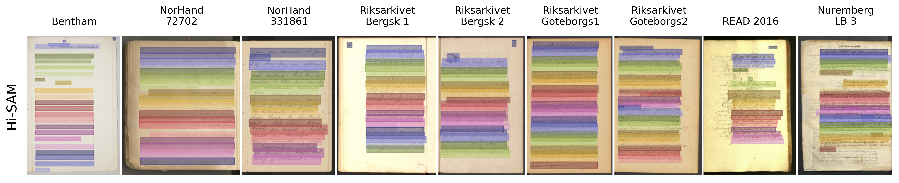

# Generalize_Text-line_Segmentation
Generalization of Text Line Segmentation for HTR in Historical Documents



You can download the Hi-SAM and YOLO models' wights trained on the mixed dataset from the URL below. Since Hi-SAM training is computationally expensive, you can use our pretrained weights to detect text lines in unseen documents.

[Model Weights](https://zenodo.org/records/22248705)

# Text-line_Segmentation Model Training

## Hi-SAM Training

All the scripts related to Hi-SAM and more details are in the <i>Hi-SAM</i> directory. 

Hi-SAM require page images, xml formatted polygon coordinates, and binary masks as the training data. However, most of datasets do not have binary images. Therefore, we can utilize the following pipeline to create the binary masks.


<b>1. Create binary masks using Hi-SAM</b>
```
python demo_hisam.py --checkpoint ../../logs/pretrained_checkpoint/hi_sam_h.pth --model-type vit_h --input ../../DATASETS/READ_2016/Training/Images --output ../../DATASETS/READ_2016/Training/labels --patch_mode 
```
<b>2. Create binary masks using Otsu Thresholding</b>

<b>3. Combine both above steps, then filter the background with polygon masks</b>
The code for step 2 and 3 are in a Notebook file in the following path:
```
Hi-SAM/image_binarization.ipynb
```

### Training Script
To train Hi-SAM, please use the following script. 
Also, makesure to copy pre-train weights to the pretrained_checkpoint directory.

|Model|Weights|
|:------:|:------:|
|Hi-SAM-H|[OneDrive](https://1drv.ms/u/s!AimBgYV7JjTlgcoxoNjp1IG7xitzrg?e=0z4QhJ)|
|Mask-Decoder| [OneDrive](https://1drv.ms/u/s!AimBgYV7JjTlgctig8BXzlCQaPm1ng?e=6XOCid)|
|ViT Encoder|[SAM](https://dl.fbaipublicfiles.com/segment_anything/sam_vit_h_4b8939.pth)


```
torchrun --nproc_per_node=6 train3_universal_2.py \
  --checkpoint "../../logs/Hi-SAM_Doc/pretrained_checkpoint/sam_vit_h_4b8939.pth" \
  --model-type vit_h \
  --output "../../logs/Hi-SAM_Doc/out" \
  --batch_size_train 1 \
  --lr_drop_patience 200 \
  --early_stop_patience 200 \
  --max_epoch_num 3000 \
  --lr 1e-4 \
  --train_datasets read2016_train \
  --val_datasets read2016_val \
  --img_ext jpg \
  --hier_det \
  --skip_words 1 \
  --data_root /home/x_gapat/PROJECTS/DATASETS/NorHandV3_331861 \
  --pretrained_path "../../logs/Hi-SAM_Doc/pretrained_checkpoint \
  --distributed True \
  --find_unused_params \
  --seed 15 \
```

### Grid-Search
We performed a grid search on the source-domain validation set to determine the optimal thresholds for each model. Specifically, we optimized the score and NMS thresholds for Hi-SAM using the F1 score. The selected thresholds were then used for all out-of-domain (OOD) evaluations. We use Hungarian Algoritm to find the best matching pair of GT and prediction boxes (Please find the more details in this article: [https://medium.com/p/212b8c3a9c5e](https://medium.com/p/212b8c3a9c5e)). 

Grid search script:
```
PRETRAINE_MODEL=103_2026-05-13_ID_16519201
python demo_text_detection_gridSearch.py \
  --checkpoint ../../logs/Hi-SAM_Doc/103_2026-05-13_ID_16519201/saved_model/MIX_RENONU_best_mAP.pth \
  --model-type vit_h \
  --pretrained_path "../../logs/Hi-SAM_Doc/pretrained_checkpoint" \
  --input "../../DATASETS/Mix_ReNoNu/val/Images" \
  --output "../../logs/Hi-SAM_Doc/H103/Mix_ReNoNu/images" \
  --save_boxes_dir "../../logs/Hi-SAM_Doc/H103/Mix_ReNoNu/boxes" \
  --dataset ctw1500 \
  --results_log "../../logs/ATS/Hi-SAM/stage1/Hi-SAM_gridsearch.txt" \
  --text TrainOn_MIX_RENONU_103-TestOn_MIX_RENONU \
```

# Prepare Data for HTR
The data loaders for our HTR models support LMDB formats as the data input. Therefore, please convert text-lines and their corresponding transcriptions into LMDBs. This enable easy file handling as now you have only 3 DB files for training, validation and testing. The conversion script is located in:
```
LMDB_Creation\LMDB_Creator.ipynb
```

# Line-Matched CER
We compute a line-matched CER, which is then aggregated over the entire data split. To align ground truth and predicted text lines, we first compute the IoU between their bounding boxes and then apply the Hungarian algorithm to obtain the optimal one-to-one assignment. This matching is necessary because the predicted bounding boxes are not guaranteed to follow the top-to-bottom reading order, and some text lines may be missed or spuriously detected. After that, the edit distance is computed for each matched pair of lines. Standard CER penalties for insertions and deletions are applied when the numbers of predicted and ground truth lines differ, thereby penalizing for extra or missing detections. Finally, the edit distances are accumulated over all lines and pages in the split and then normalized by the total number of characters \(N\).

This code is already integrated to the line segmentation models when evaluating the CER.

If you wish to use the Line-Matched CER, you can find a copy from the following path:

```
Hi-SAM\utils\HTR_CRNN\evaluate\htr_eval_fn.py
```

```
    htr_scores = HTRScores(
        args.device,
        args_charset,
        args_dir_img,
        args_gt_path,
        args_htr_crnn_model_path,
        args_height_max_line=args.htr_height_max,
        args_width_max_line=args.htr_width_max,
        args_ext_img= args.img_ext,
        IoU-matching
        args_model_config_path="utils/HTR_CRNN/configs/model_config_1.json"
    )
```

IoU-matching calculates the IoU between predicted boxes and GT boxes, then use Hungarian Algoritm to find the best matching pair.
